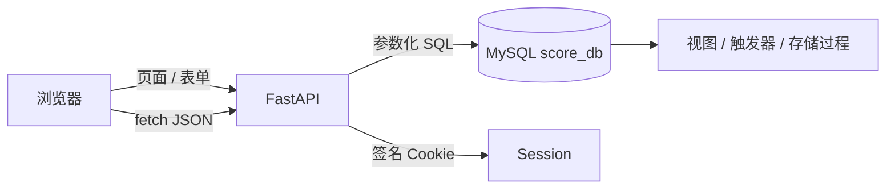
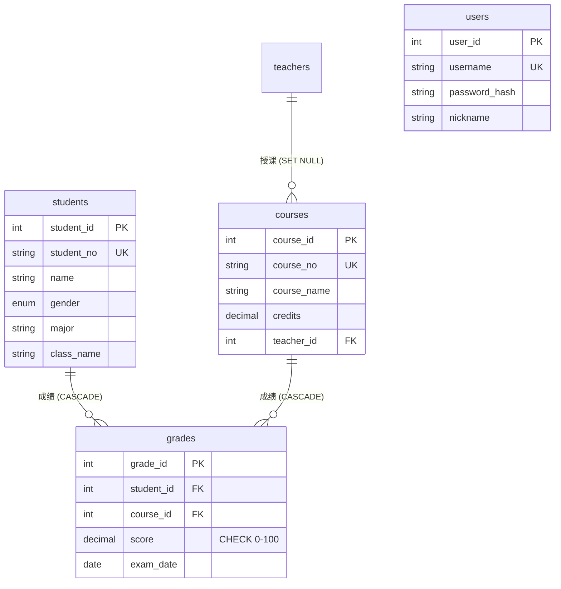

# 学生成绩管理系统

基于 **MySQL 8.0 + FastAPI** 的全栈学生成绩管理系统：数据库层用视图、触发器、存储过程保障数据完整性，应用层提供 RESTful API 与统计报表可视化。前端服务端渲染（Jinja2）+ 原生 JS + ECharts，全中文界面。

> 截图占位：登录页 / 成绩管理页 / 统计报表页（最后补拍）

## 功能特性

- **四实体管理**：学生 / 教师 / 课程 / 成绩的增删改查，支持关键字搜索与分页
- **成绩双重校验**：应用层 pydantic 校验（422）+ 数据库 BEFORE 触发器 SIGNAL 报错（1644）——绕过应用直连数据库也插不进非法成绩
- **批量导入（事务原子性）**：逐行调用存储过程，单事务包裹，任一行失败整个批次回滚
- **统计报表**：7 张 ECharts 图（含 RANK() OVER 窗口函数驱动的"各课程第一名"）+ 2 张明细表格
- **登录认证**：Session 签名 Cookie + PBKDF2-SHA256（60 万次迭代）密码哈希；页面未登录 302 跳转、API 未登录 401 JSON

## 技术栈

| 层 | 技术 | 说明 |
|---|---|---|
| 数据库 | MySQL 8.0 | InnoDB、外键级联（CASCADE / SET NULL）、CHECK 约束、BEFORE 触发器、存储过程、视图、事务、窗口函数 |
| 后端 | FastAPI + PyMySQL | 裸 SQL（参数化），刻意不用 ORM——SQL 能力是本项目卖点 |
| 前端 | Jinja2 + 原生 JS + ECharts | 服务端渲染 + fetch JSON，图表本地化（无 CDN 依赖） |
| 认证 | SessionMiddleware + PBKDF2 | stdlib hashlib 实现，零第三方密码库依赖 |

## 架构



## ER 图（5 张表）



grades 唯一键：`UNIQUE(student_id, course_id, exam_date)` —— 同一学生同一课程同一考试日期唯一，支持重修/补考按新日期另存记录。

## 快速开始

### 1. 初始化数据库

```bash
# 把 SQL 脚本所在目录设为当前目录
cd sql

# 配置免密登录路径（一次性，输入你的 MySQL root 密码）
"D:\MySQL\MySQL Server 8.0\bin\mysql_config_editor.exe" set --login-path=score_db --host=localhost --user=root --password

# 按顺序执行 5 个脚本（01 会重建全部业务表，演示数据固定从 01 开始重跑）
"D:\MySQL\MySQL Server 8.0\bin\mysql.exe" --login-path=score_db --default-character-set=utf8mb4 < 01_create_tables.sql
"D:\MySQL\MySQL Server 8.0\bin\mysql.exe" --login-path=score_db --default-character-set=utf8mb4 < 02_insert_data.sql
"D:\MySQL\MySQL Server 8.0\bin\mysql.exe" --login-path=score_db --default-character-set=utf8mb4 < 03_queries.sql
"D:\MySQL\MySQL Server 8.0\bin\mysql.exe" --login-path=score_db --default-character-set=utf8mb4 < 04_advanced.sql
"D:\MySQL\MySQL Server 8.0\bin\mysql.exe" --login-path=score_db --default-character-set=utf8mb4 --force < 05_transaction_demo.sql
```

### 2. 启动应用

```bash
# 回到项目根目录，创建虚拟环境并安装依赖
cd ..
py -m venv venv
venv\Scripts\pip install -r requirements.txt

# （可选）数据库密码写进 .env，应用读取配置；文件已在 .gitignore 中，不会提交
echo SCORE_DB_PASSWORD=你的MySQL密码 > .env

# 启动（在项目根目录）
venv\Scripts\python -m uvicorn app.main:app --port 8000
```

### 3. 访问

| 地址 | 说明 |
|---|---|
| http://127.0.0.1:8000/ | 系统入口（未登录自动跳转登录页） |
| http://127.0.0.1:8000/docs | Swagger UI 交互式 API 文档 |
| 演示账号 | `admin` / `admin123`（也可在注册页自行注册） |

## SQL 脚本一览（SQL 能力展示）

| 脚本 | 展示内容 |
|---|---|
| `sql/01_create_tables.sql` | 建库建表：外键级联策略、联合唯一键、CHECK 约束、索引设计（附选择理由） |
| `sql/02_insert_data.sql` | 幂等数据维护：TRUNCATE 重置自增、`INSERT ... ON DUPLICATE KEY UPDATE` 幂等 seed |
| `sql/03_queries.sql` | 8 个统计查询：多表 JOIN、聚合、`RANK() OVER` 窗口函数、CASE 分段统计 |
| `sql/04_advanced.sql` | 视图 ×2、成绩校验触发器 ×2（BEFORE INSERT/UPDATE + SIGNAL）、录入存储过程 ×1 |
| `sql/05_transaction_demo.sql` | 事务原子性演示：成功提交 / 失败整体回滚 / SAVEPOINT 部分回滚 |

**触发器实测**（简历可附截图）：绕过应用直连 MySQL 执行
`INSERT INTO grades VALUES (1,1,150,'2024-01-10');`
→ 被 `trg_grades_check_insert` 拒绝：`成绩必须在 0-100 之间`。

## API 一览（均在 `/docs` 可交互调试）

统一约定：页面路由未登录 → 302 `/login?next=...`；`/api` 路由未登录 → 401 JSON。
错误码语义：`400` 触发器/CHECK 拒绝（DB 中文消息透传）· `401` 未登录 · `404` 资源不存在 · `409` 唯一键冲突 · `422` 字段校验失败。

| 方法 | 路径 | 说明 |
|---|---|---|
| GET/POST | `/api/students` | 学生列表（`search`/`page`/`size`）/ 新增 |
| PUT/DELETE | `/api/students/{id}` | 修改 / 删除（级联删除成绩） |
| GET | `/api/students/options` | 学生下拉数据 |
| GET/POST | `/api/teachers` | 教师列表 / 新增 |
| PUT/DELETE | `/api/teachers/{id}` | 修改 / 删除（课程变"未分配"） |
| GET/POST | `/api/courses` | 课程列表 / 新增 |
| PUT/DELETE | `/api/courses/{id}` | 修改 / 删除（级联删除成绩） |
| GET/POST | `/api/grades` | 成绩列表（可筛选）/ 录入（双重校验） |
| PUT/DELETE | `/api/grades/{id}` | 改分 / 删除 |
| POST | `/api/grades/batch` | 批量导入：单事务逐行 `CALL sp_insert_grade`，一行失败全部回滚 |
| GET | `/api/stats/*` | 统计接口：overview / score_distribution / course_avg / course_pass_rate / class_course_avg / major_avg / gender_dist / student_scatter / course_top / fail_list / student_table |

## 设计决策记录（面试 Q&A 弹药）

1. **为什么裸 SQL 不用 ORM？** 项目定位就是展示 SQL 能力：外键、触发器、存储过程、视图、窗口函数都要手写；ORM 会把这些藏起来。裸 SQL 还能逐条讲清"这条查询走了哪个索引"。代价是每请求新开连接——当前规模可接受，生产可换连接池。
2. **为什么 PBKDF2 不用 bcrypt？** Windows + Python 3.13 下 bcrypt 无预编译 wheel，安装体验差；stdlib `hashlib.pbkdf2_hmac` 零依赖，60 万次迭代符合 OWASP 建议，存储格式自带算法与参数（便于未来升级）。另：passlib 已停止维护。
3. **双重校验的定位**：pydantic 管"入口"，触发器 + CHECK 管"数据本身"——防御纵深，即使未来有人绕过应用直连数据库，非法成绩也进不来。
4. **SSR 与 fetch JSON 的分工**：列表/搜索/分页走服务端渲染（URL 可分享、curl 可验证、首屏无 JS 依赖）；增删改走 fetch JSON（局部交互、错误码精准展示）。页面路由与 API 路由共用同一套 db 查询函数。
5. **为什么不做 CSRF token？** Session Cookie `SameSite=lax`（跨站 POST 不携带）；所有状态变更走 `Content-Type: application/json` 的 fetch（跨站表单无法伪造该类型，会触发 CORS 预检）；登出用 POST 而非 GET。演示项目在此前提下不引入 token，正式系统会加。
6. **索引只加 3 个的原因**：`students(major)`、`students(class_name)`、`grades(exam_date)` 对应真实高频分组/筛选；外键列 InnoDB 自动建索引，无需重复；其余列数据量小、无对应查询——过度索引只会增加写放大。
7. **唯一键放宽为 (student, course, exam_date)**：原 (student, course) 唯一会导致重修/补考无法录入第二条记录；加入 exam_date 后既保留防重复能力，又支持现实业务。
8. **CSRF 之外的安全点**：登录失败统一提示防用户名枚举；`next` 回跳参数只允许站内相对路径防开放重定向；密码哈希盐独立随机、常数时间比对；SQL 全部参数化。
9. **建表显式 COLLATE 的原因**：只写 `CHARSET=utf8mb4` 时 MySQL 会用字符集默认排序规则（8.0 为 `0900_ai_ci`），与建库声明的 `unicode_ci` 不一致，存储过程参数比较字符串会报 ERROR 1267（Illegal mix of collations）——所以 4 张表全部显式 `COLLATE=utf8mb4_unicode_ci`，库、表、存储过程参数三处统一。

## 目录结构

```
student/
├── sql/                    # 5 个 SQL 脚本（建表 → 数据 → 查询 → 高级对象 → 事务）
├── app/
│   ├── main.py             # FastAPI 装配：中间件、401/302 分流处理器、路由注册
│   ├── config.py           # 配置（环境变量 > .env > 默认值）
│   ├── db.py               # pymysql 连接管理 + 实体查询函数 + 错误码映射
│   ├── security.py         # PBKDF2 密码哈希
│   ├── deps.py             # 登录依赖注入（页面 / API 两种）
│   ├── schemas.py          # pydantic 请求模型（第一层校验）
│   ├── routers/            # auth / students / teachers / courses / grades / stats
│   ├── templates/          # Jinja2 模板（base + 9 页面）
│   └── static/             # style.css / common.js / echarts.min.js（本地化）
├── requirements.txt
└── README.md
```

## 简历 bullet 建议

- 独立设计 5 表 ER 模型（MySQL 8.0），用外键级联策略（CASCADE/SET NULL）、联合唯一键与 CHECK 约束保障数据完整性，并论证索引取舍（仅 3 个业务索引）
- 实现成绩"双层校验"：应用层 pydantic + 数据库 BEFORE 触发器 SIGNAL 拦截，绕过应用直连数据库也无法写入非法成绩；批量导入基于存储过程 + 单事务，一行失败全批回滚
- 基于 FastAPI 开发 RESTful API 与 10 个统计接口，用窗口函数（RANK() OVER）、视图与 ECharts 构建教学统计报表（课程/班级/专业/学生四个维度）
- 实现 Session 登录认证（PBKDF2-SHA256 60 万次迭代加盐哈希、防用户名枚举、防开放重定向），页面与 API 差异化拦截（302 / 401）

## 改进方向（不实现，展示思考深度）

连接池（DBUtils）、CSRF token、JWT 无状态认证、慢查询日志分析（EXPLAIN 优化 LIKE 前缀搜索 → 全文索引）、游标分页替代 OFFSET、单元测试（pytest + 测试库）。
